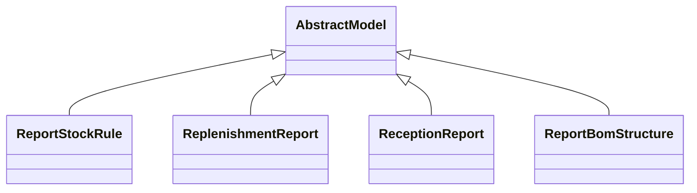

# Reports

Report definitions and templates in mrp.

## Available Reports

### PDF/Document Reports
- **Production Order** (PDF/Print)
- **BoM Overview** (PDF/Print)
- **Finished Product Label (ZPL)** (PDF/Print)
- **Finished Product Label (PDF)** (PDF/Print)
- **Work Order** (PDF/Print)

## Report Files

- **__init__.py** (Python logic)
- **mrp_production_templates.xml** (XML template/definition)
- **mrp_report_bom_structure.py** (Python logic)
- **mrp_report_bom_structure.xml** (XML template/definition)
- **mrp_report_views_main.xml** (XML template/definition)
- **mrp_workorder_templates.xml** (XML template/definition)
- **mrp_zebra_production_templates.xml** (XML template/definition)
- **report_deliveryslip.xml** (XML template/definition)
- **report_stock_forecasted.xml** (XML template/definition)
- **report_stock_reception.py** (Python logic)
- **report_stock_reception.xml** (XML template/definition)
- **report_stock_rule.py** (Python logic)
- **report_stock_rule.xml** (XML template/definition)
- **stock_forecasted.py** (Python logic)

## Notes
- Named reports above are accessible through Odoo's reporting menu
- Python files define report logic and data processing
- XML files contain report templates, definitions, and formatting
- Reports are integrated with Odoo's printing and email systems
